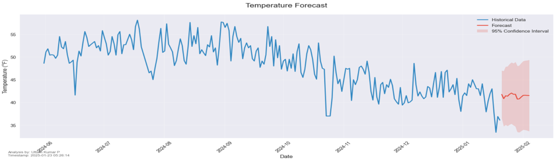
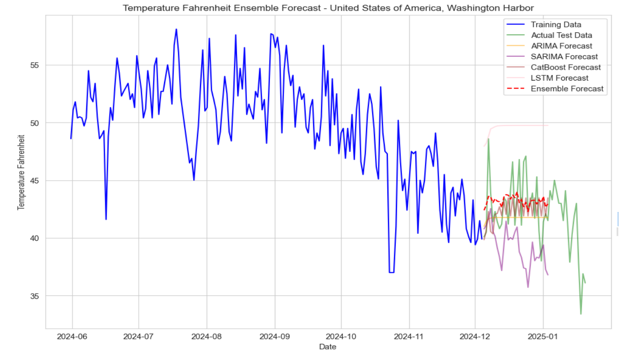

# Weather-Trend-Forecasting
Tech Assessment: Weather Trend Forecasting

To run the code, you need to install the required packages. You can do this by running the following command in the terminal:
```
pip install -r requirements.txt
```

Presented in this repository (Presentation.pdf) is a weather trend forecasting model. The data is obtained from the [Kaggle](https://www.kaggle.com/datasets/nelgiriyewithana/global-weather-repository/data). 

The model jupiter notebook file is named `Assessment_Notebook.ipynb`. The models are based on the ARIMA, LSTM, Catboost, SARIMA models. The model is trained on the historical weather data of a city and is used to forecast the weather trend for the upcoming days.

Sample outputs of the model is shown below:



